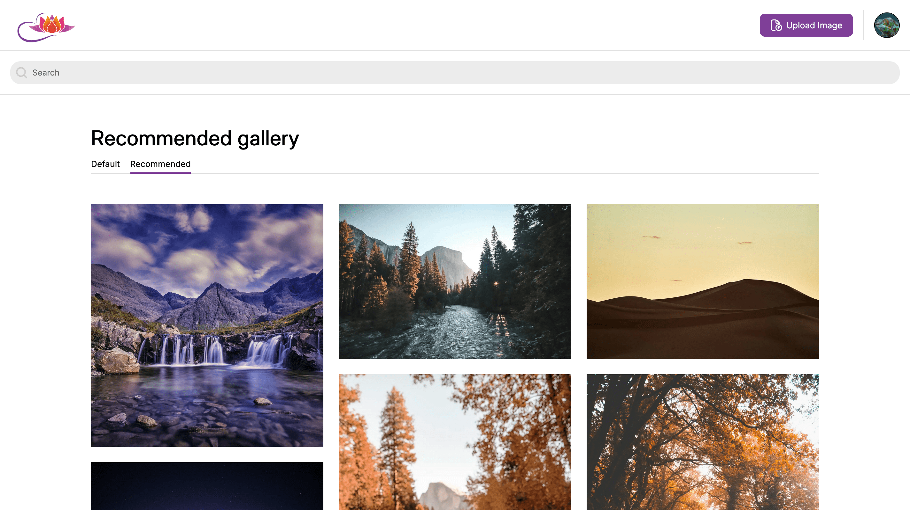
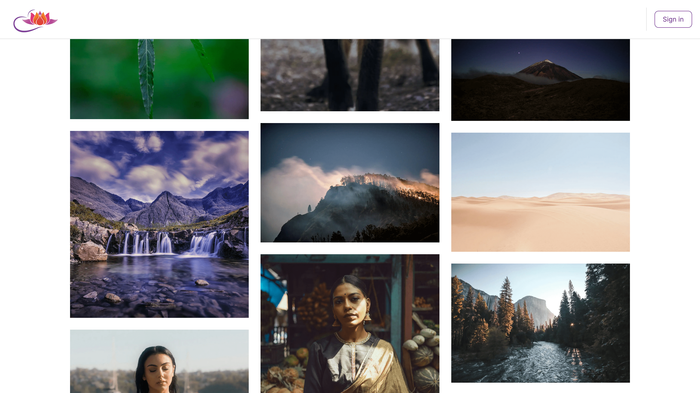
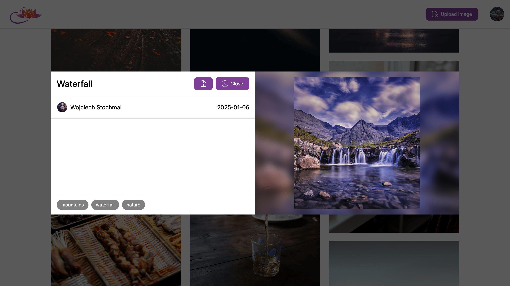
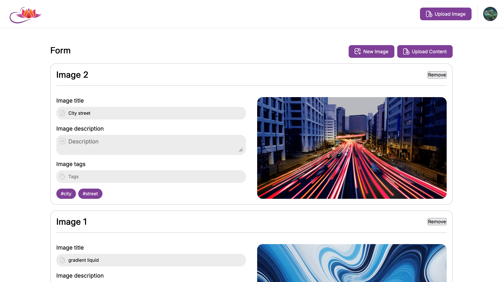

## Multimedia Content Platform

[Polska wersja](#polska-wersja) | [English version](#english-version)

---

## Polska wersja

Aplikacja webowa umożliwiająca organizowanie, wyszukiwanie i udostępnianie treści multimedialnych. Platforma oferuje obsługę kont użytkowników, tagowanie materiałów, dodawanie do ulubionych oraz system rekomendacji. Użytkownicy mogą w intuicyjny sposób przesyłać, przeglądać i pobierać pliki multimedialne.

**Stack technologiczny:**
`React`, `Next.js`, `TypeScript`, `Prisma`, `PostgreSQL`, `CSS`, `JWT`

**Główne funkcje:**

- Dodawanie i zarządzanie obrazami
- Wyszukiwanie i przeglądanie po tagach
- Pobieranie multimediów
- Autoryzacja użytkowników
- Oznaczanie ulubionych
- Spersonalizowane rekomendacje (dla zalogowanych użytkowników na podstawie ulubionych)

---

## English version

A web application for organizing, searching, and sharing multimedia content. The platform offers user account management, content tagging, favorites, and a recommendation system. Users can intuitively upload, browse, and download multimedia files.

**Tech stack:**
`React`, `Next.js`, `TypeScript`, `Prisma`, `PostgreSQL`, `CSS`, `JWT`

**Main features:**

- Upload and manage images
- Search and browse by tags
- Download media
- User authentication
- Mark favorites
- Personalized recommendations (for logged-in users based on favorites)

---

## Screenshots

